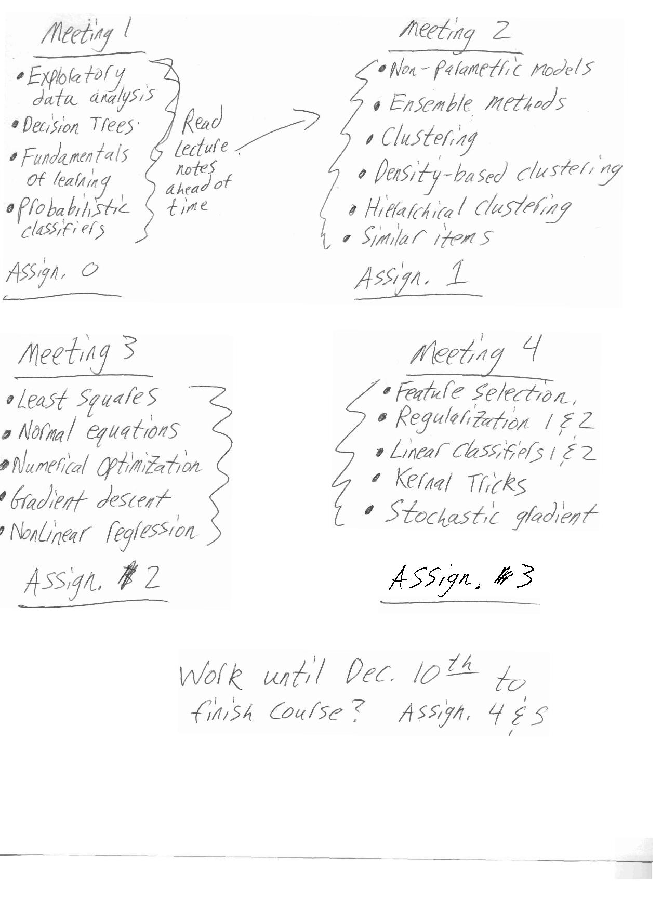

# Machine Learning

Hi guys!

This repository will be dedicated to the documents corresponding to our self-study into ML. All code can be found here: [Code](https://github.com/Mathnstein/Machine_Learning/tree/master/Code)

## Meetings

* [Meeting 1](https://github.com/Mathnstein/Machine_Learning/tree/master/Meeting%201)
* [Meeting 2](https://github.com/Mathnstein/Machine_Learning/tree/master/Meeting%202)
* [Meeting 3](https://github.com/Mathnstein/Machine_Learning/tree/master/Meeting%203)
* [Meeting 4](https://github.com/Mathnstein/Machine_Learning/tree/master/Meeting%204)
* [Meeting 5](https://github.com/Mathnstein/Machine_Learning/tree/master/Meeting%205)
* [Meeting 6](https://github.com/Mathnstein/Machine_Learning/tree/master/Meeting%206)

## Code for each section:

* A brief intro to Julia from the TUM workshop: [Intro Notebook](https://github.com/Mathnstein/Machine_Learning/blob/master/Code/julia_basics.ipynb) or
[Intro Raw](https://github.com/Mathnstein/Machine_Learning/blob/master/Code/Julia_basics.jl)
* Meeting 1: [Decision Tree Notebook](https://github.com/Mathnstein/Machine_Learning/blob/master/Code/Decision%20Tree.ipynb) or 
[Decision Tree Raw](https://github.com/Mathnstein/Machine_Learning/blob/master/Code/Decision%20Tree.jl)
* Meeting 2: [Assignment 1 notebook](https://github.com/Mathnstein/Machine_Learning/blob/master/Code/Assignment_1_Cody.ipynb)
* Meeting 3:
* Meeting 4:
* Meeting 5:
* Meeting 6:

Loosely, here is the schedule:

